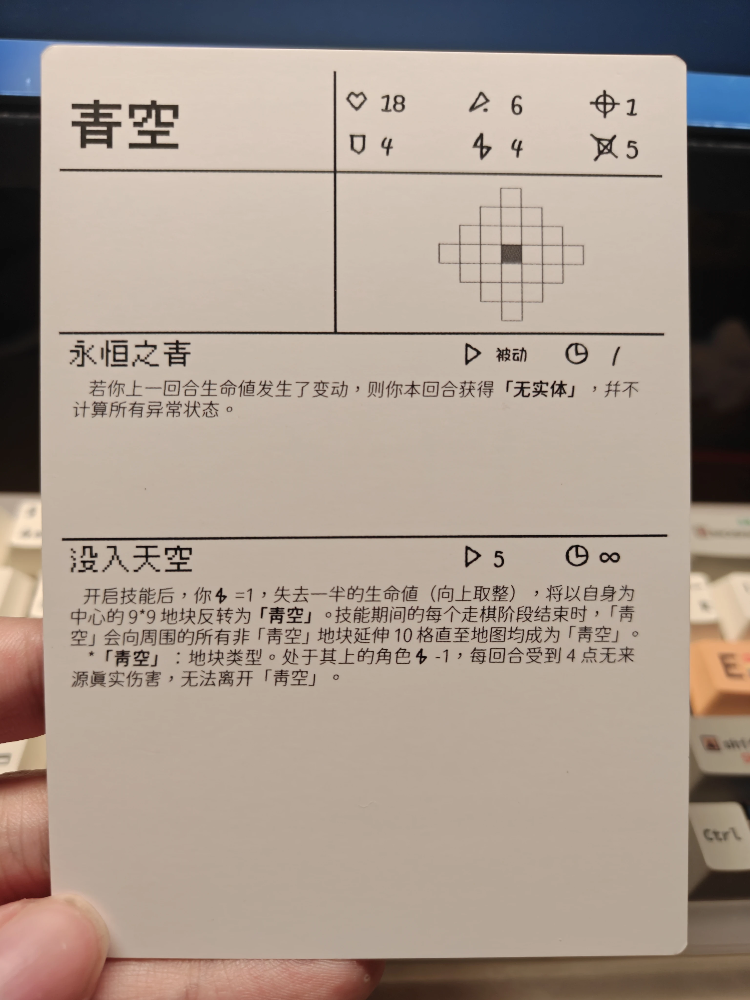

在经过漫长的和AI互相拷打和痛苦学习C#的时间后，UAC电子化也是提上了日程。

UAC电子化预期使用C#（服务端）和C#/Unity（客户端）完成。目前客户端连新建文件夹都没有，服务端已经完成了所有基本数据结构和大量辅助函数，总体架构已经趋于完成，除了尚在天国的主循环……

这里，我想展示一份用于服务端的角色文件，用于记录整体架构。角色名为“青空”。

下图为UAC桌游版的“青空”卡面。



不过这个卡面不是重点。以下为使用C#编写的“青空”角色文件。

```csharp
namespace UacCore_v2
{
    public class Character_BlueSky : CharacterBase
    {
        public Character_BlueSky()
        {
            this.Id = "Char_BlueSky";
            this.Name = "青空";
            //位置初始化
            this.Position = new Vector2Int(0, 0);
            this.FaceDirection = Direction.Up;
            //数值初始化
            this.MaxHP.BaseValue = 18;
            this.CurrentHP = 18;
            this.Attack = new Stat(6);
            this.Defense = new Stat(4);
            this.Speed = new Stat(4);
            this.CurrentSP = 0;
            this.MaxSP = new Stat(5);
            this.TargetsCount = new Stat(1);
            //使用Dictionary存储攻击范围信息，支持多种初始化攻击范围的方式
            this.AttackRange = new AttackRangeDict()
            {
                (0,3),
                (0,2),(1,2),(-1,2),
                (0,1),(1,1),(2,1),(-1,1),(-2,1),
                (0,0),(1,0),(2,0),(3,0),(-1,0),(-2,0),(-3,0),
                (0,-1),(1,-1),(2,-1),(-1,-1),(-2,-1),
                (0,-2),(1,-2),(-1,-2),
                (0,-3)
            };
        }
        //初始化，订阅“回合结束事件”，实现技能一
        public override void Initialize(EventBus bus)
        {
            base.Initialize(bus);
            bus.Subscribe<TurnEndEvent>(OnTurnEnd_NoEntity, this.Name, EventPriority.Normal);

        }
        public void OnTurnEnd_NoEntity(TurnEndEvent evt)
        {
            if (evt.Context.ElementAt(((evt.TurnNumber - 1) == 1) ? 1 : (evt.TurnNumber - 1)).CharacterList.FirstOrDefault(s => s.Name == this.Name)?.CurrentHP - CurrentHP < 0)
            {
                Character_NoEntity_Buff buff = new Character_NoEntity_Buff();
                buff.SetBuffDuration(1);
                Bus.Publish<BuffApplyEvent>(new BuffApplyEvent(this, this, this, buff));
            }
        }
        //主动开启技能2
        public override bool ActivateSkill2()
        {
            if (this.CurrentSP < 5) return false;
            this.CurrentSP -= 5;
            Bus.Publish<DamageEvent>(new DamageEvent(this, this, this, (int)(Math.Ceiling(CurrentHP / 2.0))));
            HashSet<Vector2Int> set = new HashSet<Vector2Int>();
            for (int i = this.Position.X - 4; i <= this.Position.X + 4; i++)
            {
                for (int j = this.Position.Y - 4; j <= this.Position.Y + 4; j++)
                {
                    set.Add(new Vector2Int(i, j));
                }
            }
            Bus.Publish<CellTypeSetEvent>(new CellTypeSetEvent(this, set, "Terrain_BlueSky"));
            return true;
        }
    }
    //青空的独有buff
    public class Skill_BlueSky2_Buff : BuffBase
    {
        public Skill_BlueSky2_Buff()
        {
            this.BuffId = "Skill_BlueSky2_Buff";
            this.Name = "技能：没入青空";
            this.IsPositive = true;
        }
        public override void OnAttach()
        {
            this.Owner.Speed.AddModifier(new Modifier(1, ModifierType.Override, this.BuffId));
        }
        public override void OnDetach()
        {
            this.Owner.Speed.RemoveModifier(this.BuffId);
        }
    }
    public class Terrain_BlueSky_Buff : BuffBase
    {
        public Terrain_BlueSky_Buff()
        {
            this.BuffId = "Terrain_BlueSky_Buff";
            this.Name = "没入青空";
            this.IsPositive = false;
        }
        public override void OnAttach()
        {
            this.Owner.Speed.AddModifier(new Modifier(-1, ModifierType.BaseAdd, this.BuffId));
        }
        public override void OnDetach()
        {
            this.Owner.Speed.RemoveModifier(this.BuffId);
        }
    }
    public class Character_NoEntity_Buff : BuffBase
    {
        public Character_NoEntity_Buff()
        {
            this.BuffId = "Character_NoEntity_Buff";
            this.Name = "无实体";
            this.IsPositive = true;
        }
        public override void OnAttach()
        {
            Bus.Subscribe<DamageEvent>(OnDamageEvent, this.BuffId, EventPriority.Critical);
        }
        public override void OnDetach()
        {
            Bus.Unsubscribe<DamageEvent>(OnDamageEvent);
        }
        public void OnDamageEvent(DamageEvent evt)
        {
            evt.IsCancelled = true;
            evt.DamageValue = 1;
            evt.AddLog("[Buff:NoEntity] Stopped this DamageEvent");
        }
    }
    //青空的独有地形效果
    public class BlueSkyTerrainRule : TerrainRuleBase
    {
        public BlueSkyTerrainRule()
        {
            TerrainId = "Terrain_BlueSky";
        }
        public override void Initialize(EventBus bus, GameMap map)
        {
            base.Initialize(bus, map);
            bus.Subscribe<MoveDeclareEvent>(OnMoveDeclare, GetEntityName(), EventPriority.Critical);
            bus.Subscribe<TurnStartEvent>(OnTurnStart, GetEntityName(), EventPriority.Normal);
            bus.Subscribe<TurnEndEvent>(OnTurnEnd, GetEntityName(), EventPriority.Normal);
            bus.Subscribe<PlanStageEndEvent>(OnPlanStageEnd,GetEntityName(),EventPriority.Normal);
        }
        private void OnMoveDeclare(MoveDeclareEvent evt)
        {
            var currentCell = Map.GetCell(evt.Command.Start);
            var targetCell = Map.GetCell(evt.Command.End);
            foreach (var stp in evt.Command.StepList)
            {
                if (Map.GetCell(stp.Start).CellType == this.TerrainId && Map.GetCell(stp.End).CellType != this.TerrainId)
                {
                    int index = evt.Command.StepList.IndexOf(stp);
                    evt.Command.StepList.RemoveRange(index, evt.Command.StepList.Count - index);
                    evt.AddLog($"[EventBus] Remove the MoveCommand after " +
                        $"[({stp.Start.X},{stp.Start.Y})->({stp.End.X},{stp.End.Y})] " +
                        $"because of TerrainRule {this.TerrainId}");
                    break;
                }
            }
        }
        private void OnTurnStart(TurnStartEvent evt)
        {
            foreach (var unt in evt.Context.ElementAt(evt.TurnNumber).CharacterList)
            {
                var currentCell = Map.GetCell(unt.Position);
                if (currentCell.CellType == this.TerrainId)
                {
                    var buff = new Terrain_BlueSky_Buff();
                    var applyBuffEvent = new BuffApplyEvent(this, this, unt, buff);
                    Bus.Publish(applyBuffEvent);
                }
            }

        }
        private void OnTurnEnd(TurnEndEvent evt)
        {
            foreach (var unt in evt.Context.ElementAt(evt.TurnNumber).CharacterList)
            {
                var currentCell = Map.GetCell(unt.Position);
                if (currentCell.CellType == this.TerrainId)
                {
                    Bus.Publish(new DamageEvent(this, this, unt, 4));
                }
            }
        }
        private void OnPlanStageEnd(PlanStageEndEvent evt)
        {
            List<Vector2Int> CurrentBlueSky = evt.Context.ElementAt(evt.TurnNumber).Map.GetSpecificTypeCellList(TerrainId);
            HashSet<Vector2Int> targetCells = new HashSet<Vector2Int>();
            foreach (var cel in CurrentBlueSky)
            {
                for (int i = cel.X - 7; i <= cel.X + 7; i++)
                {
                    for (int j = cel.Y - 7; j <= cel.Y + 7; j++)
                    {
                        if (0 < cel.X && cel.X <= evt.Context.ElementAt(evt.TurnNumber).Map.Width
                            && 0 < cel.Y && cel.Y <= evt.Context.ElementAt(evt.TurnNumber).Map.Height
                            && evt.Context.ElementAt(evt.TurnNumber).Map.GetCell(new Vector2Int(i, j)).CellType != this.TerrainId)
                        {
                            targetCells.Add(new Vector2Int(i, j));
                        }
                    }
                }
            }
            Bus.Publish<CellTypeSetEvent>(new CellTypeSetEvent(this,targetCells,"Terrain_BlueSky"));
        }
    }
}
```

详细解释角色文件的架构不是本文的目的。这里只简要提一下整个架构的特点：

# 高度解耦化

整个架构中几乎没有任何硬编码的逻辑，全部都是基于C#面向对象实现的高度解耦的组件。

# 全都在事件中

整个架构中，几乎所有行为都被拆解为“监听事件-发出事件-结算事件”。

例如，“青空”二技能中的“将以自身为中心9\*9范围反转为青空”在代码中实现为：开启技能时，“青空”抛出一个修改地形的事件，留待游戏引擎接受事件并结算。

再如，“青空”地形效果中的“无法离开青空”在代码中实现为：“青空”地形一旦出现，就监听所有“MoveDeclareEvent”（移动意图事件，所有角色尝试移动时都会抛出这个事件），优先级设为最高。一旦出现了监听到移动意图事件中有离开青空的Step，监听器就会强制将这个事件修改为无法离开青空。

包括Buff系统也是如此。角色-Buff-地形三个系统全部基于事件系统，实现了高度的解耦和自定义化。在这套架构下，几乎可以实现任何UAC中可能的逻辑。

# 高拓展性

这套架构利用了C#的反射特性，可以动态加载角色文件，以及与之配套的Buff和地形规则等等。

这套架构下，如果以后UAC服务端想要添加新角色甚至新机制，只需要写一个对应的文件让主程序加载即可，实现了高度拓展性，也满足了我个人当初设计UAC时想要什么就写什么的私心（笑）。

如果你真的对UAC很感兴趣/想知道UAC是什么，可以看看我博客中介绍UAC的文章（很可惜，还没写）。
