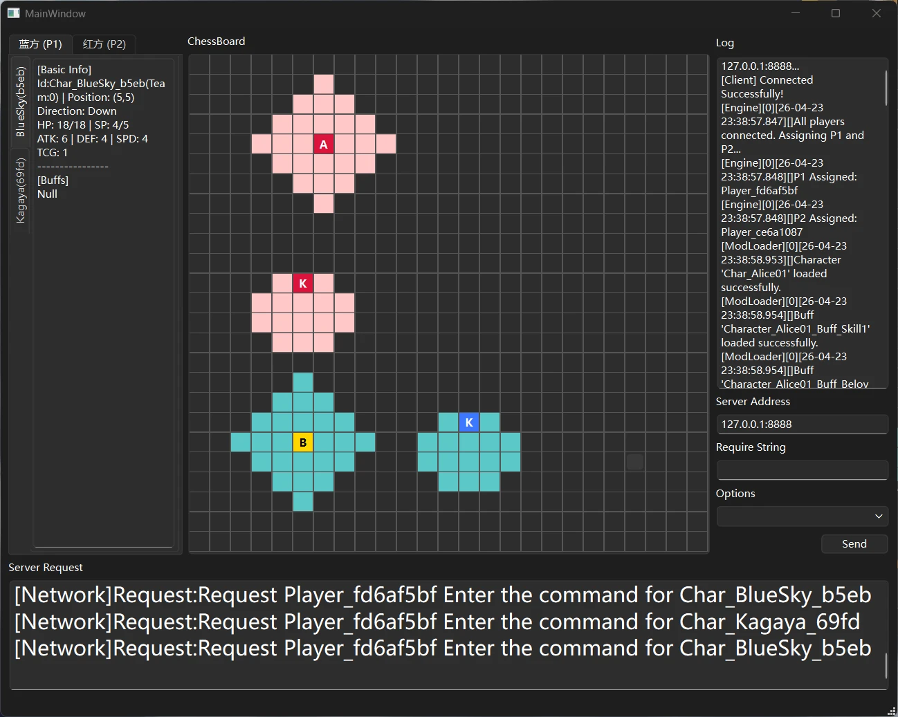

在经过长达一个半月（其中大概有一半时间都在打游戏）的开发后，UAC电子化的第一小步终于完成了。

一个具备基本服务端功能，基本实现了桌游版UAC里面那些天马行空的机制的服务端已经开发完成。另外，用于测试的具备简单图形界面的客户端也在今天开发完成。

服务端使用C#构建，网络通信协议使用TCP。目前尚未进行任何部署至服务器的测试，目前只能用于Windows环境下进行测试。默认服务端开启在本地端口上，后续会考虑部署至服务器。

客户端使用Qt/C++构建，具备一个可视化的棋盘界面，仅为初步测试开发，目的只是为了解决长时间盯着命令行的问题。

为了纪念这个历史性的时刻（其实并非），同时也是为我自己留档，这里将详细介绍服务端的各部分代码，以及客户端的使用方法。

# 服务端架构

## 总体目录结构

```
UacCore - 26/04/23
│
├─ Abstraction
│      BasicBuff.cs
│      Buff.cs
│      Character.cs
│      Interface.cs
│      TerrainRule.cs
│      Token.cs
├─ Core 
│      GameProcessor.cs
│      Logger.cs
│      ModLoader.cs
│      Network.cs
│      Program.cs
│
├─ DataStruct
│      AttackRange.cs
│      GameContext.cs
│      Map.cs
│      NetworkMessage.cs
│      Player.cs
│      Stat.cs
│
├─ Event
│      BasicEvent.cs
│      Event.cs
│
├─ Mod
│      Character_Alice01.cs
│      Character_BlueSky.cs
│      Character_Kagaya.cs
│      Character_Tester.cs
│
```

### Abstraction

该目录包含了所有UAC数据结构的底层抽象，包括Character、Buff、Token、TerrainRule（地形规则）以及底层接口实现。出于架构上的考虑，Event相关的抽象放在了单独的文件夹里面。

#### Character

Charater.cs包含CharacterBase的定义，也就是所有将来开发的角色文件都需要继承的抽象基类。其内部包含了所有Character的数据定义描述，以及各种供基类重写的方法。

需要注意的是，各项角色数值（如攻击力ATK，攻击目标数TCG）没有使用单纯的int类型，而是使用一个特殊的专用于处理数值的类Stat。Stat类的定义如下：

```csharp
 public class Stat : IDeepClonable<Stat>
 {
     private int BaseValue { get; set; }

     private List<Modifier> Modifiers { get; set; } = [];

     public void AddModifier(Modifier modifier)

     public void RemoveModifier(string modifierId)

     public int GetValue()
 }
```

所有数值都拥有属于自己的BaseValue，也就是初始值。之后的所有数值变化（如攻击力增减）都是通过向Stat类中增加Modifier实现的，Modifier的定义如下：

Modifier描述该项数值如何对Stat造成改变，这是取决于ModifierType（包含BaseAdd，BaseMultiply，FinalAdd，FinalMultiply，Override五种不同的运算方式）的。在Stat的GetValue方法中，会对BaseValue依次按Type执行Modifier的运算，并且返回最终值。例如，“攻击力+2”被描述为“向角色的AttackStat中加入一个数值为-2，Type为BaseAdd的Modifier”。

UAC中另一个非常重要的元素就是角色的技能。在Character.cs中提供了描述技能元数据（技能名，技能消耗）的类SkillDefination，同时在CharacterBase中提供了void ActivateSkill1/2方法供子类重写技能的实现。

同时，Interface.cs提供的ISetupRequired接口供那些需要在游戏正式开始前进行选择的角色类继承，以实现在游戏开始前发送客户端消息，实现设定的功能。例如，角色Alice01需要在开始游戏前选择一名友方角色赋予特殊Buff。

关于技能具体是如何实现的，请看下文。

#### Buff&BasicBuff

在原本的桌游版UAC中，buff的含义只是数值的增减。

但是，在服务端中，为了整体架构的简洁，buff被赋予了至关重要的作用。

这是BuffBase的定义，所有Buff均继承这个抽象基类。

```csharp
public abstract class BuffBase : IGameEntity
 {
     public string BuffId { get; protected set; } = "DefaultId";
     public string Name { get; protected set; } = "DefaultName";
     public int Duration { get; set; } = 0;
     public int Stacks { get; set; } = 1;
     public GameContext? Context { get; protected set; }
     public BuffCategory Category { get; set; } = BuffCategory.Normal;
     public bool IsPositive { get; protected set; }
     public CharacterBase Owner { get; protected set; } = null!;
     public EventBus Bus { get; protected set; } = null!;

     public void Attach(CharacterBase target, EventBus bus, int duration, GameContext context, int stacks = 1)

     public void Detach()

     public virtual void OnAttach() { }

     public virtual void OnProvideModifiers() { }

     public virtual void OnTick() { }

     public virtual void OnDetach() { }
 }
```

可以看到，BuffBase除了描述Buff的元数据，还提供了大量虚函数供子类重写。在这些函数中，可以实现非常复杂的逻辑，几乎所有复杂机制都是基于buff的这几个函数实现的。

例如，OnProvideModifiers这一方法，顾名思义，是用于提供Modifier的。当前架构下所有对角色数值进行修改的行为，都是通过Modifier实现。而Modifier的唯一来源就是该方法，换句话说，所有数值增减都是基于Buff实现的。

再如，OnTick这一方法，在每回合结束时会调用。该方法可以实现任何基于回合数的逻辑，甚至可以依据回合数不同实现不同的效果，这完全取决于派生类的代码。

另外，技能的效果部分也通过Buff实现。在当前架构下“角色是否开启技能”的标识就是是否持有该技能对应的Buff。技能中所有非瞬时的效果也全部通过Buff中的各个虚函数重写实现的。

#### TerrainRule

基于桌游版UAC对于地块相关机制的开发，同时为了保证架构的高可拓展性，地块类型本身也作为作为一个独立的类存在，而不是写死在地图数据里面的“Type=xxx”。

地形规则基于地块类型。每个地块类型都有属于自己的地形规则类，描述该类型的效果，即使这个效果非常复杂。

例如：*「锈疫」：地块类型。若敌方在结算阶段时位于「锈疫」上且攻击范围内不包含「神之子·深寻」则受到等同于其攻击力的无来源真实伤害。若我方角色位于「锈疫」上，则攻击目标时使以目标为中心3\*3内地块转变为「锈疫」；若该角色回合开始时攻击范围内包含「神之子·深寻」，则其本回合获得ATK+3。*

为了实现这样的复杂效果，TerrainRuleBase（也就是所有地形规则的基类）实现如下：

```csharp
public abstract class TerrainRuleBase : IGameEntity
{
    public string TerrainId { get; set; } = null!;
    protected GameContext Context { get; private set; } = null!;
    protected EventBus Bus { get; private set; } = null!;
    public virtual void Initialize(EventBus bus, GameContext context)
    {
        Bus = bus;
        Context = context;
    }
}
```

单看这段代码，也许并不能找到在哪里承载这么多复杂逻辑。但是注意，“地形规则”不是一个动态的东西，它是一种规则。换句话说，不论场上是否存在这种地块，地形规则始终存在。因此，在子类重写的Initialize（也就是加载地形规则的函数）中，可以加入对事件的监听和处理，而这些都是通过自定义的函数实现的，当然可以承载复杂规则。例如地形规则“青空”：

```csharp
    public class BlueSkyTerrainRule : TerrainRuleBase
    {
        public BlueSkyTerrainRule()
        {
            TerrainId = "Terrain_BlueSky";
        }
        public override void Initialize(EventBus bus, GameContext context)
        {
            base.Initialize(bus, context);
            bus.Subscribe<MoveDeclareEvent>(OnMoveDeclare, GetEntityId(), EventPriority.Critical);
            bus.Subscribe<TurnStartEvent>(OnTurnStart, GetEntityId(), EventPriority.Normal);
            bus.Subscribe<EndStageStartEvent>(OnEndStageStart, GetEntityId(), EventPriority.Normal);
            bus.Subscribe<TurnEndEvent>(OnTurnEnd, GetEntityId(), EventPriority.Normal);
        }
        private void OnMoveDeclare(MoveDeclareEvent evt)
        {
            var currentCell = Context.Engine.Map.GetCell(evt.StartPosition);
            var targetCell = Context.Engine.Map.GetCell(evt.EndPosition);
            bool hasCut = false;
            for (int i = 0; i < evt.StepList.Count; i++)
            {
                var stp = evt.StepList[i];
                if (Context.Engine.Map.GetCell(stp.Start).CellType == this.TerrainId
                    && Context.Engine.Map.GetCell(stp.End).CellType != this.TerrainId)
                {
                    //截断超出的步数
                    evt.StepList.RemoveRange(i, evt.StepList.Count - i);
                    if (evt.MoveList.Count > i)
                    {
                        evt.MoveList.RemoveRange(i, evt.MoveList.Count - i);
                    }
                    hasCut = true;
                    break;
                }
            }
            if (hasCut)
            {
                evt.AddLog($"[EventBus] {this.TerrainId} Cut the MoveDeclareEvent after ({evt.EndPosition.X},{evt.EndPosition.Y})");
            }
        }
        //回合开始时检查角色位置，赋予减速buff
        private void OnTurnStart(TurnStartEvent evt)
        {
            foreach (var unt in this.Context.Engine.AllAliveUnits)
            {
                var currentCell = Context.Engine.Map.GetCell(unt.Position);
                if (currentCell.CellType == this.TerrainId)
                {
                    var buff = new Terrain_BlueSky_Buff_IntoTheSky();
                    buff.SetBuffDuration(1);
                    var applyBuffEvent = new BuffApplyEvent(this, this, unt, buff);
                    Context.Engine.EnqueueEvent(applyBuffEvent);
                }
            }
        }
        //回合结束时造成真实伤害
        private void OnEndStageStart(EndStageStartEvent evt)
        {
            foreach (var unt in Context.Engine.AllAliveUnits)
            {
                var currentCell = Context.Engine.Map.GetCell(unt.Position);
                if (currentCell.CellType == this.TerrainId)
                {
                    Context.Engine.EnqueueEvent(new DamageEvent(this, this, unt, 4));
                }
            }
        }
        //扩散机制，回合结束时扩散
        private void OnTurnEnd(TurnEndEvent evt)
        {
            List<Vector2Int> CurrentBlueSky = Context.Engine.Map.GetSpecificTypeCellList(TerrainId);
            HashSet<Vector2Int> targetCells = new HashSet<Vector2Int>();
            foreach (var cel in CurrentBlueSky)
            {
                for (int i = cel.X - 5; i <= cel.X + 5; i++)
                {
                    for (int j = cel.Y - 5; j <= cel.Y + 5; j++)
                    {
                        if (0 <= i && i < Context.Engine.Map.Width
                            && 0 <= j && j < Context.Engine.Map.Height
                            && Context.Engine.Map.GetCell(new Vector2Int(i, j)).CellType != this.TerrainId)
                        {
                            targetCells.Add(new Vector2Int(i, j));
                        }
                    }
                }
            }
            if (targetCells.Count != 0)
            {
                Context.Engine.EnqueueEvent(new CellTypeSetEvent(this, targetCells, this.TerrainId));
            }
        }
    }
}
```

上述代码实现了“青空”地形规则，包含如下效果：当一个处在“青空”上的角色的移动结果会导致其位置不再在“青空”上时，对其进行截断；当角色位于“青空”上时，为其赋予减速效果；当角色位于“青空”上时，每回合对其造成一定数量的真伤；每回合结束时，“青空”会向半径为5的地块扩散。

#### Token

区别于Buff，Token本身并不承载复杂逻辑。这也与其中文“标记”符合。

每个角色均持有一个TokenList，本身只是封装了各种列表操作。

### DataStruct

#### Player

该数据结构描述一局对战中的玩家，除了包含玩家的元数据，还提供了从字符串（因为目前就是使用字符串与客户端通信的）解析玩家指令的各种方法。

#### NetworkMessage

该数据结构规定了网络通信中的数据形式，并且提供了一个BuildJson方法来将不同形式的消息打包为格式统一的Json发送给客户端：

```csharp
public static class ProtocolBuilder
{
    public static string BuildJson(string type, object data)
    {
        var message = new NetworkMessage(type, data);
        var options = new JsonSerializerOptions { PropertyNamingPolicy = JsonNamingPolicy.CamelCase };
        return JsonSerializer.Serialize(message, options);
    }
}
```

#### AttackRange&Map

这部分是一切的起点：整个UAC服务端就是从Map文件开始的。

在这部分文件里面，规定了最基本的数据结构Vector2Int（描述位置）、Cell（描述地图地块），CellEdge（描述墙和移动Step）以及实现了多个辅助方法，例如GetWorldRange用于将基于角色本身的相对攻击范围转化为地图上的绝对攻击范围。

值得注意的是，在CellEdge中重写了Equal和GetHashCode方法：

```csharp
public struct CellEdge : IEquatable<CellEdge>
{
    public Vector2Int Start { get; set; }
    public Vector2Int End { get; set; }
    public CellEdge(Vector2Int start, Vector2Int end)

    public readonly bool Equals(CellEdge other)
    {
        return (Start == other.Start && End == other.End) ||
                   (Start == other.End && End == other.Start);
    }

    //override Equals to compare with object
    public readonly override bool Equals(Object? obj)
        => obj is CellEdge other && Equals(other);
    public readonly override int GetHashCode()
    {
        int hash1 = Start.GetHashCode();
        int hash2 = End.GetHashCode();
        return hash1 < hash2
            ? HashCode.Combine(hash1, hash2)
            : HashCode.Combine(hash2, hash1);
    }
}
```

其中重写的Equal方法保证了不论Start和End的顺序如何，只要表示的地块边缘是同一条，他们就被视为相同的。而重写的GetHashCode保证了在地块操作中使用的大量基于哈希表的LINQ语法不出错。

AttackRange本身与Map有诸多相似的数据结构。这里值得讲一下的是为AttackRange设计的一套类似Stat的Modifier系统：

```csharp
public enum RangeModifierType
{
    Add,
    Remove,
    Override,
}
public class AttackRangeModifier : IEquatable<AttackRangeModifier>
{
    public RangeModifierType Type { get; set; }

    public string ModifierId { get; set; }

    public AttackRangeDict RangeData { get; set; }

    public AttackRangeModifier(RangeModifierType type, string modifierId, AttackRangeDict rangeData)  
}
```

与Stat一样，AttackRange也由BaseValue和Modifier共同构成。Modifier存在Add、Remove和Override三种类型，可以方便的实现“攻击范围扩大”、“废除xx攻击范围”或者“自定义获取xx格攻击范围”的效果。

### Event及事件驱动架构

当前架构是所谓的“事件驱动架构”，也就是说，所有对实体进行的操作行为都被设计为“抛出事件-订阅者传递事件-引擎最终执行事件”的逻辑，这样可以轻松实现多种互相影响的复杂逻辑。

例如，角色A持有Buff“愤怒X”（造成的伤害+X），角色B持有Buff“脆弱Y”（受到的伤害+Y），与角色B同队的角色C开启了技能“治愈光环”（使攻击范围内的友方角色受到的伤害-Z），同时角色B的脚底下的地块类型为“浊”（位于该地块上的角色受到伤害时同时失去1点技力）。在这个复杂的场景下，角色B进入了角色A的攻击范围，收到了攻击。让我们看看事件驱动架构是如何处理这个场景的：

- “浊”地块初始化的时候就注册一个订阅者，监听所有类型为“DamageEvent”的事件，优先级设为Lowest。
- “愤怒”Buff挂载时也注册一个订阅者，监听所有类型为“DamageEvent”的事件，优先级设为Normal。
- “脆弱”Buff挂载时也注册一个订阅者，监听所有类型为“DamageEvent”的事件，优先级也设为Normal。
- 角色C开启技能时为自己挂载技能相对应的Buff，这个Buff在挂载时注册一个订阅者，监听所有类型为“DamageEvent”的事件，优先级设为Critical。
- 角色A攻击角色B，抛出一个类型为“DamageEvent”的事件，发出者为A，目标为B，事件内的DamageValue为A的攻击力减去B的防御力。
- 事件首先进入角色C的订阅者，该订阅者首先判断事件的目标是否为范围内的友方角色，然后将事件的DamageValue减去Z。
- 事件继续流转，进入两个Buff的订阅者，DamageValue+X+Y。
- 事件进入地块的订阅者，订阅者判断目标B位置位于“浊”上，于是抛出一个新的“SkillPointDecreaseEvent”，用于使角色B失去技力。
- 最终，事件进入引擎层。引擎层执行最后的数值增减，将B的生命值减去（Damage-Z+X+Y）点。

这就是事件驱动架构。其核心为“一切皆事件”，将所有行为处理为事件的抛出、修改与最终处理。所有数值上的改变均有引擎本身代办，保证了安全性和高度可扩展性。即使将来增加再多buff、再多地形规则，这套架构的可靠性
也不会有所变化。

现在来看这套架构是如何在代码上实现的。

#### EventBase

该数据结构描述了所有事件的抽象基类：

```csharp
 public abstract class EventBase
 {
     public IGameEntity Sender { get; set; }
     public EntityType EntityType => Sender.Type;
     public string CancelledBy { get; set; } = "Default";
     public bool IsCancelled { get; set; } = false;
     public List<string> AuditLog { get; } = new List<string>();
     public void AddLog(string log) => AuditLog.Add(log);
     protected EventBase(IGameEntity sender)

     public string GetEventName()

     public void PrintLog()

     public void CancelEvent(IGameEntity canceller)

     public virtual string GetLogMessage() { return "EventBase"; 

     private string ConvertPascalCaseToUnderscoreSeparated(string pascalCase)
 }
```

所有事件必定有一个发出者（也就是Sender），事件本身还拥有一个String List，用于记录事件在不同的订阅者之间流转的日志。同时，事件也可以被取消，由IsCancelled记录。事件本身是从高优先级依次向低优先级传递的，因此如果事件被取消了，那么更低优先级的订阅者就看不到这个事件了。

#### EventBus 事件总线

这是整个事件驱动架构的核心。

```csharp
public EventBus
{
     private readonly Dictionary<Type, List<Subscription>> _subscribers；

     public void Subscribe<T>(Action<T> handler, string subscriberName, EventPriority eventPriority = EventPriority.Normal)

     public void Unsubscribe<T>(Action<T> handler) where T : EventBase

     public void Publish<T>(T eventData) where T : EventBase
}
```

\_subscribers为所有订阅者的列表，订阅者内部包含订阅者的元数据和处理时间的Handler函数。订阅者订阅事件的时候，也会把“自己如何处理这个事件”的函数传递过去，打包成一个Subscription对象塞进_subscribers列表里面。

Publish函数用于发布事件。所有事件一经发布就会立刻被丢进订阅者列表里面，在订阅者之间流转结束后最终生效。

#### 事件泵

Publish一个事件的逻辑足够处理大部分场景，但是通常会有这样的情况：一个事件的监听器本身也会抛出事件。虽然UAC中结算时从字面意思上来说是同时执行的，但是这种“事件导致事件”仍然构成先后关系。因此，如果事件A的执行结果本身会影响事件B的执行，但A在订阅者列表中流转到一半时就使用Publish函数抛出了B事件，这种情况下就导致A还没有真正落地B就执行完成了，通常会导致时序上的问题。

因此，引入了事件泵来解决这个问题。

事件泵的思路很简单：不在事件发出时就执行，而是等待一个合理的时间点再统一执行。在这个时间点之前发布的所有事件都会被暂存在事件泵当中，等待统一执行。事件泵本身是一个队列，在事件泵执行过程新增的事件同样也会被压入事件泵，如此直到事件泵被清空。

这样不仅解决了时序逻辑的问题，还便于控制递归深度：例如两个有反伤的角色互相攻击，很有可能导致无限递归。事件泵可以通过控制订阅者向事件泵中新压入的事件计数来方便的避免无限递归的情况。

事件泵的具体实现见下文。

### Core

这部分为服务端主循环和重要部件的实现。

#### Network

该文件实现了启动TcpServer与客户端通信的功能，并且提供了RequestString和RequestOptions方法供向客户端请求指令。

#### ModLoader

这部分实现了热加载UAC角色文件。整个服务端从一开始就是按照角色文件独立开发、运行过程可以热加载的目标来开发的，因此这部分也最先实现，且几乎没有重构过。

ModLoader会扫描特定目录下的所有.cs文件，并将其中继承于CharacterBase、BuffBase和TerrainRuleBase的部分通过Roslyn编译器动态编译并发送给主程序。

#### Logger

用于输出和记录日志的相关函数。

#### GameProcessor

实现游戏主逻辑。

文件主要包括ProcessPlanPhase，ProcessResolutionPhase和ProcessEndPhase三个方法和大量辅助函数，以及引擎底层Handler的实现。

前三个函数分别对应桌游版UAC的“走棋阶段”、“结算阶段”和“结束阶段”，将整体游戏逻辑封装起来。

引擎本身也是依照事件驱动架构来处理事件的，所以在引擎的底层实现了对所有事件的订阅，且优先级都为Monitor（最低的优先级）。相应的Handler也写在GameProcessor里面。

#### Program.cs

一切的起点，程序的入口。

作为Main函数，将上述所有代码封装起来，实现从启动服务端-加载角色文件-执行BP阶段-执行对局-结算对局的全流程。

另外，当前架构还实现了同步输入，也就是连接的两个客户端可以同时被请求指令、同时发送请求而不需一方等待另一方，算是还原桌游版的体验了。

服务端到此已经叙述完毕。详细代码可在Github上下载。

# 客户端架构

客户端是一个基于Qt/C++开发的简陋GUI程序，界面如下：



界面的左侧为当前场上所有角色的状态栏，状态栏中选中的角色会在中间的棋盘上高亮（黄色）显示。

界面中央为棋盘。双方角色均在棋盘上表示，角色以其名称的首字母代替，角色自身的攻击范围以浅一点的颜色表示。

界面右侧上方为Log栏，目前只是将服务端的日志原封不动搬过来，方便调试。

Log栏下方为ServerAddress输入栏。服务端默认在127.0.0.1:8888地址开启，这里的默认值也是这个地址。启动客户端之后，鼠标点击一下该输入栏并且回车，客户端才会开始尝试连接服务端。

界面右侧下方为输入栏。对于要求字符串作为输入的请求，在StringInput栏输入然后点击Send即可。对于要求进行选择的请求，在下方的Options栏中选择对应选项并点击Send即可。

界面下方为请求栏，用大号字体显示当前的服务端请求。

相关的文件将在之后上传至我的Github。

所有资产遵循CC BY-NC-SA 4.0协议开源。

> *附言：*
> 
> *这个项目是我继上学期的Cpp大作业之后第一次认真的去写一个项目。对我来说，写项目其实就是学习，而且是比坐在教室里面听那些形而上的话、看那些ppt有用的多的学习。*
> 
> *我在写这个项目的过程中，慢慢熟悉了C#的语法，真的不由得感叹C#真是一门优雅到家的语言。各种各样的语法糖和简洁的语法，还有微软的宇宙第一IDE的加持，让写C#真的是一种享受。当然，没有诋毁C++的意思，项目后期使用C++开发客户端的速度非常快，一下午就搞定了，不过也许只是Qt太优雅了，而不是C++。*
> 
> *我感觉我当初报考计算机专业很大程度上就是为了这个项目。也许这个项目在未来会继续拓展，成为一个庞大的、真正的游戏。不过那是之后的事了。*

> *附言：*
> 
> *这个项目是我继上学期的Cpp大作业之后第一次认真的去写一个项目。对我来说，写项目其实就是学习，而且是比坐在教室里面听那些形而上的话、看那些ppt有用的多的学习。*
> 
> *我在写这个项目的过程中，慢慢熟悉了C#的语法，真的不由得感叹C#真是一门优雅到家的语言。各种各样的语法糖和简洁的语法，还有微软的宇宙第一IDE的加持，让写C#真的是一种享受。当然，没有诋毁C++的意思，项目后期使用C++开发客户端的速度非常快，一下午就搞定了，不过也许只是Qt太优雅了，而不是C++。*
> 
> *我感觉我当初报考计算机专业很大程度上就是为了这个项目。也许这个项目在未来会继续拓展，成为一个庞大的、真正的游戏。不过那是之后的事了。*
