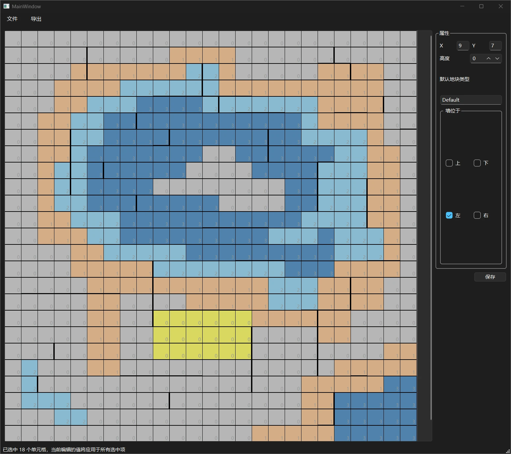
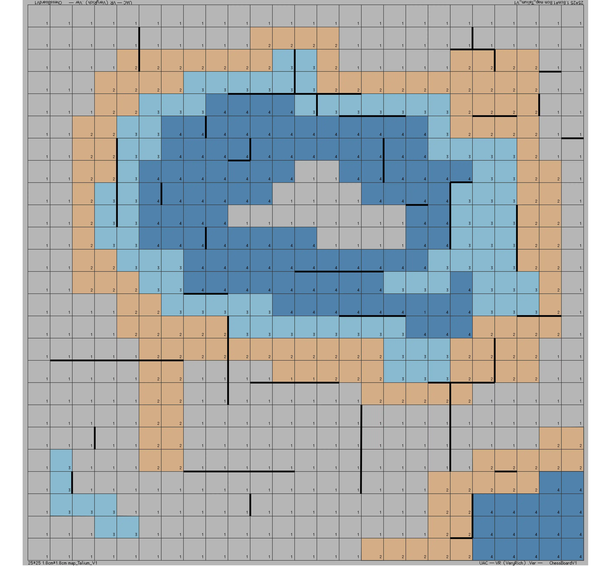
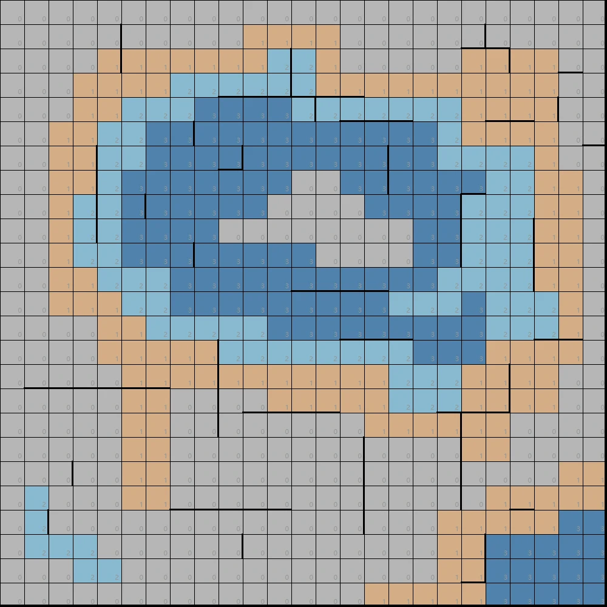

在上一篇介绍当前UAC开发进度的日志里，读者可能注意到了不论是客户端界面上，还是服务端程序的源代码中，“墙”（也就是CellEdge）的存在感都不是很强烈。

这是因为，当时我还没有实现地图配置相关的部分。

现在这部分也完全实现了。包括在服务端的加载地图配置的相关代码，以及本文的重点：地图编辑器。

# 地图编辑器

## 介绍

这是一个使用Qt/C++编写的小应用，相关代码已上传至我的Github。

这个应用可以生成可以被服务端正确读取的地图配置文件，格式为Json。

该应用的界面如图：

界面左侧为地图预览视图，黄色高亮的为当前选择的地块，支持使用Ctrl/Shift/鼠标左键拖拽来进行多选。

右侧为地块属性修改栏。由于墙存在于两个地块中间，如果使用图形化的方式让用户选择墙，会相当别扭。因此使用了这种取巧的方式，只需要选择墙存在于当前地块的上/下/左/右就行了。也就是说，上方地块下方的墙和下方地块上方的墙其实是同一堵墙。

如果批量选择了地块，那么数值的修改会同步在所有选中的地块中。

## 效果展示

这是我在之前使用Adobe Illustrator绘制的初版地图：

这是我使用该地图编辑器做出来的效果：

想来真是令人感慨。去年暑假我花了大概四个小时学习Adobe Illustrator，用了大半天的时间才把初版地图做出来。而现在我编写程序、调试和使用它制作出这张地图的时间，加起来也就不到半天。

只能说人确实在进步。

下一步的计划是修改之前那个丑爆了的客户端，将其变得清晰一点，之后就可以准备进行游戏玩法的验证和角色文件的测试了。