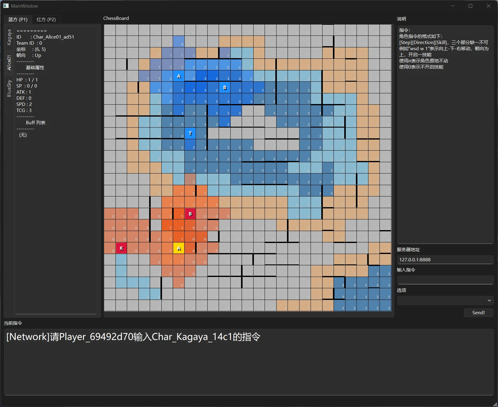

在之前的日志中提到的测试客户端，在实际进行测试使用之后，显得相当不足。

最初的客户端不仅布局混乱，连许多基本功能（比如显示墙）都没有实现。

为了之后的测试有效进行，我结合地图编辑器中渲染地图的相关代码，重构了原有客户端。

# 全新客户端

## 介绍

依旧使用Qt/C++编写，中心棋盘效果使用QTableWidget结合自定义绘制委托实现

该应用的界面如图：

界面左侧为角色信息展示，左侧的角色会在棋盘中对应高亮显示。

界面中央为棋盘，蓝色/红色分别代表双方队伍，较淡的颜色则代表该角色的攻击范围，重合的攻击范围会显示为较深的颜色，且带有斜向黑色条纹。

棋盘格子的基础颜色基于高度，不同的高度显示为不同的颜色，便于区分。

界面右侧为输入栏。在服务器地址栏输入地址后，点按回车会开始尝试连接服务端。下方分别对应服务端发来的“自定义指令请求”和“选择请求”。在完成指令规划后，点按Send按钮向服务端发送指令。

界面下方为来自服务端的请求，目前服务端还没有做相应适配。服务端适配后，将会更加清晰的展示出当前需要输入的指令。

说实话，这个配色看着还是有点混乱。不过考虑到信息量和当前只是一个临时测试客户端，就不做进一步修改了。