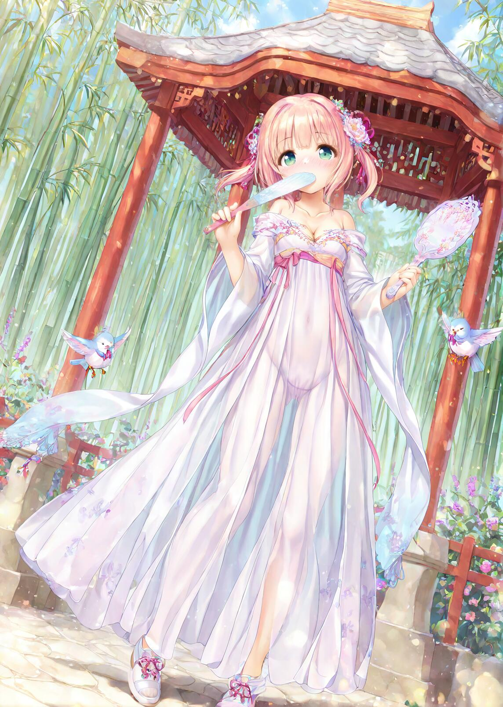
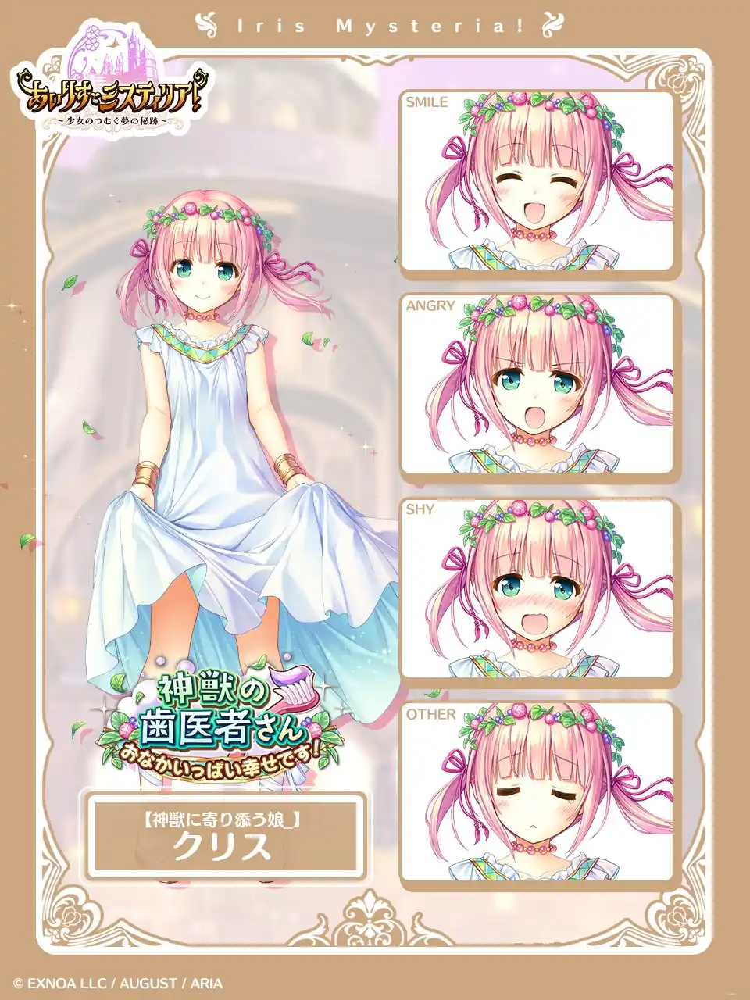
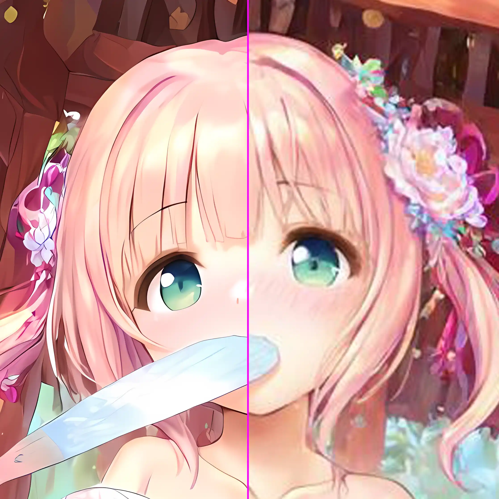
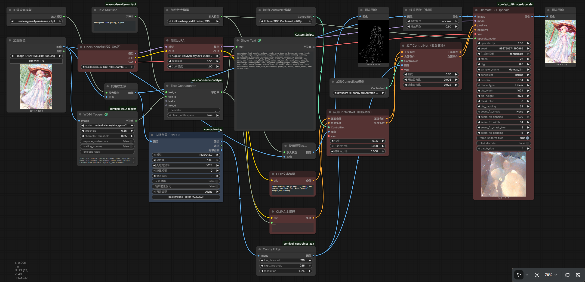
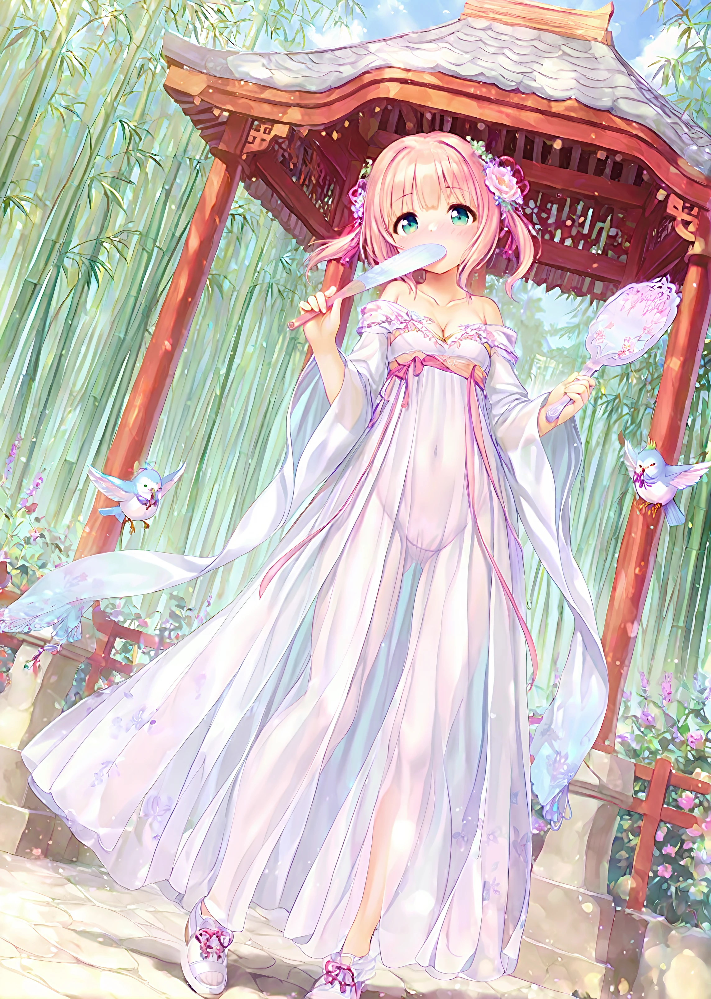

# 使用ComfyUI实现的模糊动漫图片高清化

> *ComfyUI最大的优势就是节点化。比起WebUI中简单甚至可以说得上是简陋的图片超分手段（无非就是应用放大模型和高清修复），你可以在ComfyUI中设计及其复杂的工作流，最大程度规避传统超分模型带来的问题*
> 
> *即使是公认最好的动漫放大模型`RealESRGAN-Anime6B`或者宣称自己解决了图片超分问题的`APISR`也没能彻底规避传统放大模型带来的缺陷：涂抹感和细节丢失。涂抹感是指超分后的图片各种线条已经融合在了一起（一般而言，看角色的头发就很容易看出来），细节丢失指的是在原始图片中还勉强可以辨认的细节因为超分和背景融合在了一起。*
> 
> *因此，办法就只剩下了一个：运用SD模型来辅助放大。*

## 🦌乃是第一生产力

促使我研究更好的超分图片的原因，其实是一张图片。

 

这张图片的出处不可考（也许是ai生成出来的？），不清晰至极（这里的图片是原图），甚至经过多次QQ的图像压缩。唯一能确定的是这张图的角色是**八月社**页游中的一个名为クリス的角色：

看片要看高清的，图片显然更要高清。怀着这样虔诚且炽热的信念……我开始尝试将这张图片高清化……

## 原理

传统的超分模型的诸多缺陷已经在引言中介绍过。这里放张对比图。

其中左为`RealESRGAN-Anime`超分两次（也就是从1104*1608@294KB到11384*16800@101.4MB）,即使这里的图片是压缩过的，也能看出来左侧图片虽然相比右侧更加清晰，但是类似脸上的红晕这样的细节被模糊成了一片淡粉色（按理来说，这里应该有人为画出来的脸红的纹理）；再如头发，也有很明显的涂抹感。

这些缺陷是超分模型无法克服的。超分模型本质上只是在增加分辨率的情况下避免强行增加分辨率导致的锯齿。虽然，按理来说，超分模型也能往原图上添加新信息，但是相比于StableDiffusion这种专门绘图的模型，显然能力还是有所不足。

StableDiffusion模型并不能直接接受一张图片然后将其放大。为了实现这个目标，我们需要搭建一个工作流：

让我来为你介绍他是如何工作的：

这个工作流核心思想是“先通过超分模型生成一张差不多的图，然后由StableDiffusion模型在上面补画细节”。为此，这个工作流使用了`ControlNet`、`WD14 Tagger`两条路线来限制StableDiffuison只尽到补画细节的职责而不自行添加元素导致不像原图。

### ControlNet

这里使用了两个`ControlNet`节点：`Tile`和`Canny`。前者负责将原图的每一个像素都精准的参加进StableDiffusion的补画过程，确保整体构图、画风等和原图完全一致；后者是我发现单纯地应用`Tile`节点可能会导致生成的图片的线条出现短线的情况，于是采用它来强化边缘的绘制。

### WD14 Tagger

`WD14 Tagger`是基于DeepDanbooru（一个AI绘图标签网站）的数据库的提示词反推模型。在这里，我使用这个节点反推原图提示词，再用于约束StableDiffusion的重绘过程。

理论上，这条路线也可以使用`IP Adapter`实现，不过那是另一篇文章的主题了。

### 底模选择与LoRA

整个工作流的核心——StableDiffusion模型，我选择了`wai-illustrious-SDXL`。本身SDXL模型就具有比SD1.5更好的指令遵循和细节绘制能力，我这次的目标分辨率（2000\*2000左右）也更适合SDXL绘制。虽然，`wai-illustrious-SDXL`作为光辉系模型，其实并不是特别适合这张图片（赛璐珞风格）的超分，但是在这里作为演示完全是够了。

另外，为了进一步保持原图的画风（也就是俗称的“八月脸”），我还特地使用了针对八月画风训练的LoRA[`August-IrisMyth-styleV1.0`](https://civitai.com/models/1657791)。这个LoRA的训练素材为八月社页游CG，恰好和我这张原图相符合。

### 细节调整

整个工作流除了上述的几条主要路线外，还有许多细节上的东西，例如这个工作流应用了三种不同的放大模型，这些就留由读者自行探索。

至于参数方面，由于是在原图基础上重绘，因此放大节点的`Denoise`设定为0.34偏低，调度器选择`dpmpp_2m karras`在这种场景中一般认为表现较好；两个ControlNet的权重分别为1.x和0.7~0.9，依据不同的参数最终画面的效果也有所不同。

## 成果

由于上传到博客不得不压缩图片，这里仅供参考效果。

目前我还没有完全解决生成的图片有油画感的问题，预计可以通过更换底模来解决。本文提供的工作流是测试可用的。

不过就算这样，看起来也还不错吧！
