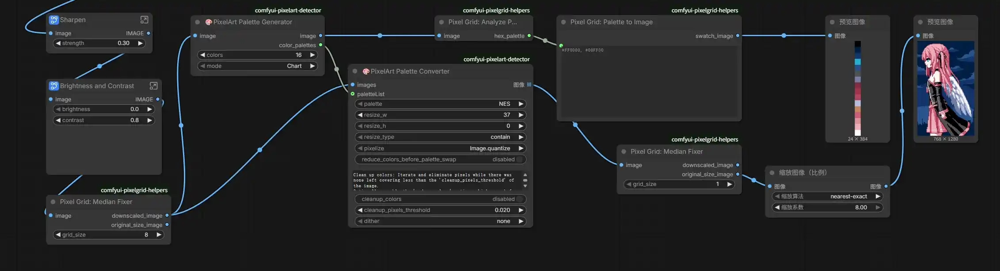

# 在ComfyUI中生成真·像素风格图片的方式

>  *在使用AI绘图时，如果想要生成像素风格的图片，最传统的方式是在提示词中添加`Pixel Art`或类似的prompt，或者单纯使用能够实现像素风格的LoRA。*
> 
> *但是，这样的方式通常都有几个不可避免的问题。其中最严重的就是”AI并没有办法生成真正的像素风格画——它们只是看着像像素风格而已，实际上仔细观察就可以发现这些图片的像素根本没有对齐，同一个像素内也有多个颜色存在“。*
> 
> *另一方面，使用像素风格的LoRA也存在与其他LoRA不兼容的问题，例如最常见的GoodHand就与Pixel Art不兼容，会出现恐怖的手部肢体问题。*
> 
> *在WebUI中，有一个内置脚本`Palette`。这个脚本可以对图片执行颜色量化（Color Quantized），同时执行网格对齐（Grid Resolution）。这个脚本可以帮助用户将AI生成的图片处理为真正的像素画。*
> 
> *可惜，ComfyUI中似乎并没有这么方便的脚本……*

## 从LoRA到Checkpoints

原先，生成像素风格图画的方式是简单的应用一层LoRA到大模型上。

如引言所说，这样的方式会与其他LoRA发生冲突，同时效果其实并不是太好。

因此，只需要基于像素画训练一个”专门画像素画“的SD模型，问题就解决了。

我使用的模型为[MiaoMiao Pixel V-Pred_1.1](https://civitai.com/models/1180112)，这是一个专门为像素画制作的SDXL大模型，实测下来无论是指令遵循度还是人物细节都控制的很好。

当然，这个模型还是不可能画出完美的像素画。

 

## ComfyUI在搞什么？

当我从WebUI转向ComfyUI，想要在ComfyUI中实现我在WebUI中使用Palette脚本实现的简单像素对齐和色彩处理时，问题出现了：

**ComfyUI中没有一个（是的，我翻遍了插件商店，除却那些和我目前版本不兼容的）节点可以同时完美执行像素对齐和颜色量化**

例如`PixelArt Palette Converter`这个节点，看起来它似乎可以同时执行颜色量化和网格对齐，实际上它却根本没办法正确的对齐网格，总是出现莫名其妙的锯齿。

再如`Pixel Grid:Median Fixer`这个节点，虽然它完美的解决了网格对齐的问题，但是跟他同一个节点包（`comfyui-pixelgrid-helpers`）内的另一个用于颜色量化的节点根本没有提供禁用Dither的选项，导致这个节点包执行的颜色量化会像CRT显示器那样出现彩虹条纹。

因此，只能把这两个包结合在一起了。

## 最终方案

如图，这就是我最终的像素对齐+颜色量化的方案。

### 预处理

整个图片从最左边的节点接受模型生成的原始图片作为输入。首先经过调整锐化、对比度和饱和度的节点，方便后续的处理。

### 色表提取与像素对齐

这部分使用了两个节点。图片首先通过`Palette Generator`生成色表信息（也就是，使图片只包括16种颜色，模拟早期像素艺术的效果），然后经过`Median Fixer`执行第一次像素对齐。

### 色表应用与第二次对齐

由于`PixelArt Palette Converter`本身自带一个无法禁用的像素对齐功能，因此在使用这个节点应用色表之后，还需要在进行一次像素对齐，之后才可以输出完美的图片。

也许你会问，为什么需要应用两次像素对齐？不能只在最后进行像素对齐吗？

答案是，经过我的测试，如果不进行第一次像素对齐，那么应用色表之后的图片会变得非常诡异，以至于无法进行对齐。

请看最终的效果：

如果你觉得似乎没什么区别，可以将图片下载下来。修复前的图片并不能作为美术资产放入像素游戏内，因为它实际上并不是由真正的像素组成的。

> ****题外话：这个节点在搞什么？****
> 
> *节点`FL PixelArt`是我最初使用的像素对齐节点。可惜这个节点有着致命的缺陷。首先，这个节点使用的是及其简陋的”先把图片应用Nearest算法缩小四倍，再用这个算法放大回来“的方式。这种方式实际上并不能真正的对齐像素。虽然看起来确实是整齐的一块一块的颜色了，但每一个单独的块内还是有许多杂色。并且，这个图片也使像素边缘出现锯齿。
> 若不是亲自去读了这个节点的代码，我可能还会觉得是我参数配置或者预处理有问题。*
