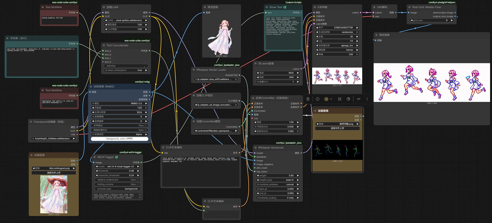
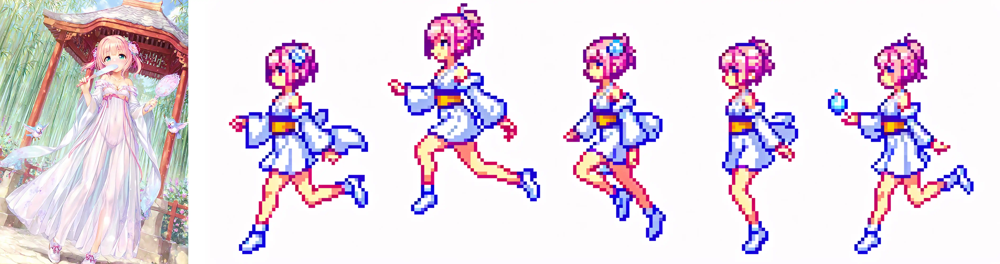
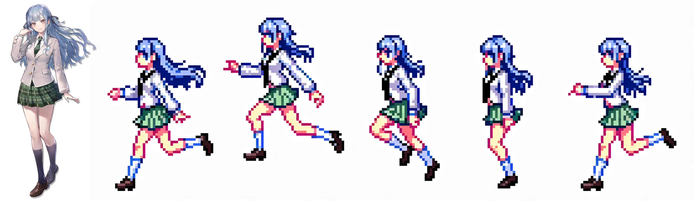

# 使用ComfyUI批量化生成像素帧序列图

> *在独立游戏开发中，往往需要大量标准化、一致性强的美术资产。如果单纯使用StableDiffusion来生成，很有可能遇见一致性缺失的情况。即使同样的提示词，也有可能因为种子的不同，导致美术资产一致性不高，最终导致做出来的游戏“一眼AI”。*
> 
> *本文介绍了一个可以接受角色图片输入，并依据这张图片上的角色信息生成对应像素化角色的帧序列图的工作流。*

## 需求是什么？

假如，你想要制作一款二次元同人小游戏，名字叫做……“sthginkra”，里面充满了你喜欢的二次元角色。

可是，你没有任何能力自行绘制你喜欢的二次元角色的游戏素材，例如帧序列图（用于实现动画）、neta的立绘（用来舔）等等。

这个工作流就是为了解决这个问题而设计的。

## 原理

这个工作流被设计成图生图的样式，但也不是单纯的图生图，而是从图片中提取角色特征再绘制成像素帧序列图。

为了实现这个原理，整体工作流分为两部分：特征提取和条件绘制。

### 特征提取

为了精准的重现原图角色特征，这里采用了两条路线来保证重现角色特征，分别是`WD14 Tagger`和`IP Adapter`。

#### WD14 Tagger

这个节点已经在另一篇文章中介绍过了。简而言之，这是一个可以将图片转换为提示词的节点。

不过，这个工作流并没有直接使用`WD14 Tagger`反推的提示词。这个节点虽然可以生成描述角色特征的图片，但一方面会生成其他的无关的tag，例如`see_through`、`from_view`这种对生成帧序列没有意义的tag和类似`ass_visible_through_thighs`这种一般非NSFW模型无法理解的Tag；另一方面，`WD14 Tagger`反推的提示词不带权重，各种各样的提示词都混在一起。在像素化这种“对角色做减法”的情景下，提示词太多反而会导致生成的角色特征不鲜明。

这个工作流使用的方式是将`WD14 Tagger`生成的提示词和实际输入到模型的提示词分开。在第一次运行时，用户可以对反推的提示词进行修改，在将其用于后续生成。一般来说，需要删除跟背景相关的Tag，以及将角色最鲜明的特征Tag（例如瞳色、发色等）提升权重到1.2左右。

#### IP Adapter

*我超！黑科技！*

`IP Adapter`是一个轻量化的节点，负责将输入图像的特征直接集成到StableDiffusion模型中。

你可以理解为`IP Adapter`是一个及其方便的LoRA，不需要预先使用这个角色的图片集进行训练。只需要在运行时接收一张图片，就可以约束模型生成的图片具有接收图片的特征。

因此你也可以看到，`IP Adapter`是直接接在加载模型节点的后面的。

### 条件绘制

#### 角色特征控制

如上文所说，通过`WD14 Tagger`反推的提示词和`IP Adapter`在模型层面上的控制，已经可以实现精准复刻角色特征了。

#### 帧序列图控制和像素图控制

这个工作流使用`ControlNet Openpose`来控制生成帧序列图。

`ControlNet Openpose`接收一张人物骨架图，控制模型生成的图片中人物动作和骨架图一致。

这个工作流使用C站上的[2D Pixel Toolkit](https://civitai.com/models/165876)中的像素LoRA来确保生成的图片是像素图，再有`Pixel Median`节点转换为真像素图。

### 完整工作流

工作流如图所示：

工作流中还有一些细节，例如使用去除了背景的图片来控制生成而不是原始图片、`IP Adapter`的控制模式设定为`ease in/ease in-out`而非`linear`等。这些就由读者自行探索了。

## 成果展示

目前工作流已经可以生成用于游戏制作的帧序列图，但是还是需要多次生成来获得最好的素材（俗称抽奖）。

另外，目前工作流对于具有复杂细节的角色支持也不是很好。这个就有待后续改进了。理论上，将基础模型换为SDXL（目前是SD 1.5）可以有更好的表现。

### 黄图

实在没有办法还原长裙子……其他都还好。

### 丰川祥子

这个算是还原很好的了，不至于认不出来。

## 更进一步

这个工作流还有许多可以扩展的点。例如，可以引入图片处理来使`IP Adapter`实现更好的迁移效果、可以引入大语言模型API来获得自动化处理提示词……不过那是以后的事了。
